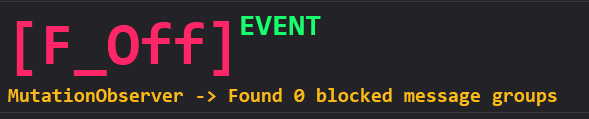

<h1 align="center">  F*ck Off </h1>

<em>
A Firefox extension to hide blocked messages on Discord
</em>
 
 

## File structure

* All the code is located in [`./scripts/app.js`](./scripts/app.js)
* The API is used to distribute any changes Discord has made to their website in real time without including an updater of sorts. API related files are found under [`./api/constants.json`](./api/constants.json)

## Permissions

This extension requires access to of course `discord.com`; however, it also requires access to `raw.githubusercontent.com` because of the dynamic API utilized for easy updates and distribution. 

## Is it even working?

If you want to make sure the extension is working, do the following:

1. Refresh Discord web page
2. Open up Inspect Element
3. Head over to `Console` tab
4. Search for `[F_Off]` and there should be some text looking like the following:

## Privacy

Look at [`./scripts/app.js`](./scripts/app.js). Nothing is being collected, the extension just access the API JSON file to lookup which DOM elements should be removed (ie considered "blocked messages")
